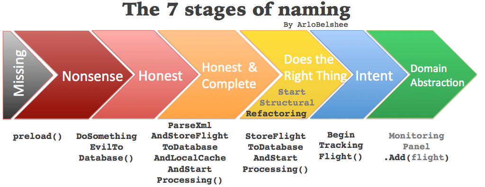

#TOPICS
How does our code become unmanageable? A practical example
- fast-forward demo through the life of an (apparently) trivial function


## Legacy Code Anonymous ...
Hello... My name is Carlo, 

and I have been writing Legacy Code for 15 years...


### This workshop is not about the "perfect" way to develop software

### but more on the need for never stop improving our approach


## My phone does not work
Can you have a look? 


## The requirements
How does our code become unmanageable? A practical example
- fast-forward demo through the life of an (apparently) trivial function

Write an expense report tool that
- runs in a folder where employee expense excel (csv for now) are stored
- a file for each month (e.g. 01.csv for January)


## Specifications
### Input

```csv
10/01/2015, 10.50
11/01/2015, 8.50
12/01/2015, 5.50
15/01/2015, 8.50
```

### Expected output
- compute the monthly total and produce <<month>>-report.txt

```
Month January

Expenses: 4
Amount: 33
```


## Convert coffee to code...
Version 1... 
implemented in 15 minutes! :-) 

not good but not so bad

[labs/clean-code-expenses-bad](labs/clean-code-expenses-bad)


# Can you also...
- add a type of expense
- skip an header row

```csv
Date, Type, Amount
10/01/2015, Train, 10.50
```

- produce an html report
- compute expenses per category
- detect if the expenses are more than threshold


## The results
another 15 minutes - I am a 10x-programmer!

120 Lines, and already unmaintainable

[labs/clean-code-expenses-ugly](labs/clean-code-expenses-ugly)


## the effects: 
* code-writing time -> decreases
* application-ready time -> never done
* time needed for bug fixes and new features -> increases


## what happens after 6 months?
The original developer has left the company and your boss asks you: 

>Can you simply automatically do this for all employees?
> and fix the case where the input file is incorrect
> and fix the rounding errors
>And keep two intermediate totals for cash and credit card expenses?

>And integrate with the acccounting application?


#:-(
>Well... it will take N weeks just to understand and fix the bugs in the original code...

Which become months with regression testing


##why this happens? 
the "deadly sins" of development 
* cut & paste,
* optimization lust
* haste
* false savings 
* naming avarice
* trial and error wrath
* my code is perfect pride
* making it right is too hard - discouragement


#Lab 01
Lab

* write down 3 problems with the expense report code


#Exercises 
* try to keep track of how much time you waste because of bad code
  * just tick a mark every time it happens


#Learn more
* Symptoms of Rotten Design
  * http://www.objectmentor.com/resources/articles/Principles_and_Patterns.pdf


##What can we do about that? 
Clean Code, Design Principles and Lean to the rescue
- improving our code
- improving our design
- practice, practice, practice and continuous / daily improvement (Kaizen)


## What can we do about that? 
* Ideas -> 3 post it


## Do you know this man? 


## It is _not_ brain surgery 
* Ignaz Semmelweis
  * http://www.npr.org/sections/health-shots/2015/01/12/375663920/the-doctor-who-championed-hand-washing-and-saved-women-s-lives
  * http://semmelweis.org/about/dr-semmelweis-biography/
  
* He championed washing hands before childbirth and surgery
  
    
  
## The simples things are the most difficult to do
* he was obstracized by the medical community!
  * it can't be that simple...
  * we just don't have time...

* And now?


## Clean Code
* It cannot solve all development problems...

* But it can make them way more tractable!


## Design Principles
Once we have got the basics covered, then we will need to understand the Software Dynamics
* vs the nature (and Laws) of Software

Take them into account => Design Principles

Basically, Common Sense applied to software design
>Treat your code like your kitchen
> C.B., about 2013


## Improve our code
It takes a Deliberate approach and constant effort

>To complicate is easy, to simplify is hard
>To complicate, just add, everyone is able to complicate
>Few are able to simplify
>Bruno Munari


## Practice
> If I don't practice for a day, I notice
> If I don't practice for two days, my orchestra notices
> If I don't practice for three days, the public notice
> Claudio Abbado

- practice, practice, practice and continuous / daily improvement (Kaizen)
  * _deliberate practice_ -> iterate small skills until >90% perfect


##Practice and Katas
Code Katas


##Clean Code by example: key concepts


##Concept 1 - Naming
- reading code vs writing code
- what is a good name?
- same but different: the importance of conventions
- be meaningful
- aside: commit messages


##Code ?!#%
## Why does this matter? 
A little experiment

Write down: 
- what the software does
- how long it took to understand it
- which bugs you can find in the code
- how long it took to find them


## Ready - Set - Go!
Group A: go to http://plnkr.co/edit/dQldXF

Group B: go to http://plnkr.co/edit/zPXf70?


##reading code vs writing code
>What is written without effort is in general read without pleasure.
>
>Samuel Johnson

Most code is written once, but read
* every time you need to fix a bug
* to add new features
* by other developers
  * including your future self 
  
  

##what is a good name?
* Ideas?


## What is a good name


 * nonsense
 * honest
 * honest & complete
 * does the right thing
 * intent
 * domain abstraction
 
http://llewellynfalco.blogspot.it/p/infographics.html


## be meaningful
* good code shouldn't almost require naming comments


##same but different: the importance of conventions
How do you read this code: 

```
float tempC; 
float farTemp 
```


## If it is different, it must have a meaning

```
float celsiusTemperature; 
float farenheitTemperature; 

```


##Lab
Lab 1: write down a function for computing the amount of days between two dates
* jot it down
* check that it works
* review the naming of each variable and function 
* check that it works
* review the naming - again
* discuss it with your neighbour


## Lab 2
Lab 2: refactor the first example
* http://plnkr.co/edit/lVa8ws?p=preview
* http://plnkr.co/edit/zPXf70?p=preview


## Tip: 
* avoid mental mapping

```
  formatMessage("File not found",2);
  formatMessage("File not available",1);
  formatMessage("File loaded",3);

```


## Why? 
* Mental energy is finite
  * attention over time
  * amount of information: 7 +/- 2
 
* do not waste it in useless mappings
  * see http://www.amazon.it/Badass-Making-Awesome-Kathy-Sierra/dp/1491919019


##aside: commit messages
Everything is like code
* configuration files
* infrastructure
* scripts
And 
* commit log messages
  * a message to your future self (and team mates)
  ``` git commit -m "bug fix" ```


#Learn more
* https://en.wikipedia.org/wiki/Leap_year#Algorithm
* http://blog.speziale.it/post/Scorporo-dei-prezzi-ivati-problema-del-e2809ccentesimo-pazzoe2809d.aspx


##Concept 2 - Formatting
- making code readable
- making code diff-friendly & commit-friendly
- making code modification-friendly


##Code ?!#%
What does this code do?
http://plnkr.co/edit/mZtyDG?p=info


##Making code readable
* the IDE does most of that for you
* share a team guideline
  * possibly, a shared style template 
  
  
  
## Making code diff-friendly 
* diffs work mainly line by line
* each line should have a different reason / time to change


##Html example

```html
   <div>Threshold <input type="number" style="color : red" min ="5"
     max = "57" class ="outline"
     ></div>
```
vs
```html
   <div>
     Threshold 
     <input type="number" min ="5" max = "57" 
            style="color : red" class ="outline"
     >
   </div>
```


## Making code commit-friendly
* this makes thing also merge-friendly

## Making code modification-friendly 
* A modification per line


##Lab
Refactor this

* http://plnkr.co/edit/91t0kv?p=preview


##Concept 3 - What's in a good function?
- single responsibility
- separing inputs from outputs
- if you have to do 3 things, make 4 functions
- primitives and orchestrators


##Code ?!#%
See the ``gen()`` function again


## Single Responsibility
>Each function should do 1 thing

Or even better, have a single responsibility
* and reason to change


## how to find responsibilities? 
Ask yourself questions...

* What? 
* Who?
* When?
* Why?
* Where?

And put the answer in different sub-functions


## Inputs vs outputs
* make inputs clear
* limit / avoid output parameters


## 3 things, 4 functions
If your function needs to perform a non-trivial task: 
* import data, transform it and store it in the DB

Instead of 
```js
  readData(){
    file.open();
    while(..)
      {
        line = readLine();
        obj = trasformLine(line);
        saveInDB(obj); 
      }
  }
```
what's better?


## 3 things, 4 functions 
```
  importData(){
    data = readData();
    obj = transformData (data); 
    saveInDB(obj);
   }  
```

* a function for each step
* a function to call the steps


## Primitives, Orchestrators, level of abstraction
* Primitives: small, focused, typically use-case independent
* Orchestrators: implement use-cases by combining primitives

* rinse and repeat over multiple levels of abstraction

* benefits:
  * more reusable
  * easier to test


##Lab
* Parse the Meteo Data file and compute the weekly min and max temperature


##Concept 4 - What's in a good class? Design Principles
- Single Responsibility Principle
- collaborating with other classes
- composition vs inheritance (and the Open/Closed principle)
- Dependency Injection
- interfaces and the importante of Contracts


##Single Responsibility Principle
Have you ever seen your grandmother put dirty clothes in the fridge?

Or biscuits in the vegetable box?

So, why to we do this all the time in our code? 


##Single Responsibility Principle
Responsibility == reason to change


## SRP - Again
A class should do one thing
* and have a single reason to change 

Consequences:
* classes should be small
* classes should be focused
* classes need to collaborate to perform complex tasks


##LAB
* Take the "ugly" code or any other code example
* Paste it in word / Google Docs
* Outline in different colors the various responsibilities


## Collaborating classes
* We need a way of making collaboration easier

* With Dependency Injection
  * separate creation of classes from linking instances
  * create A
  * create B
  * something else passes B to A

* You do not need a framework for that...


## Inheritance - with caution
* Inheritance is the strongest link between classes
* useful with caution


## Prefer composition
* combine parts 
* a derived class becomes the composition of a base behaviour + additional custom behaviour


## OCP 
>Open for extension, Closed for Modification


## Interfaces and Contracts
* esplicit vs implicit
* Decoupling changes and detecting regressions
* separate clean parts from dirty code


##Lab
* Design the classes for the additional requirements for the expense report

* Can you simply automatically do this for all employees?
* and fix the case where the input file is incorrect
* keep two intermediate totals for cash and credit card expenses?
* integrate with the acccounting application


##Concept 5 - Making our code Testable
- avoid statics
- testable code vs good design


##Code ?!#%


## Tips and tricks
- avoid statics
- decouple code


## Testable code and Good Design aligment
Things that make code testable
* clear interfaces
* small classes / functions
* decoupled
* composition

Things that make code well-designed, easy to evolve
* clear interfaces
* small classes / functions
* decoupled
* composition


##More practice and Katas
* http://matteo.vaccari.name/blog/tdd-resources


#Learn more
* http://misko.hevery.com/code-reviewers-guide/


##Concept 6 - Making debug and troubleshooting easier
- one task - one statement
- make return values visible
- logging


##Code ?!#%
```java
			BufferedReader reader = new BufferedReader(new FileReader(fileName));
			
			String line = reader.readLine();
			while(line != null)
			{
				String [] lineElements = line.split(",");
				forecasts.add(new MeteoForecast(lineElements[1],
						formatter.parse(lineElements[0]),
						Integer.parseInt(lineElements[2]),Integer.parseInt(lineElements[3].trim()), lineElements[4])

				);

```

It contains a mistake - go debug it!
[./labs/lab-debug-01](./labs/lab-debug-01)


##One task - one statement
The ``forecast.add(...`` line both
* has multiple responsibilities
* manipulates multiple values

So split it!

Even one statement -> multiple lines, 
* where the language supports it


## return values
Having temporary variables for return values
* makes debugging easier
  * inspecting the value _during_ construction
  * inspecting the value _before_ returning
    * even modifying it in some debuggers  
* makes type errors more visible

Also modern debuggers are able to display the value inline
* http://plnkr.co/edit/WoP0Ry?p=preview


##Logging
* make log messages understandable 
  * avoid mental mapping
* make them easy to search


##Lab
Refactor the example


## If you only remember 1 thing
Your code should read like a terse prose of _simple_ statements
* this also helps with debugging!


##Concept 7 - Refactoring
- from bad code to good code
- in steps
- learn your IDE refactoring tools
- The "Boy Scout Rule"
- Why we need unit tests?


##Code ?!#%
* Go back to the "ugly" example


## From bad to good
Incremental transformation


## In steps
* Each step should not change the functional properties of the system
* and improve the non-functional ones

* separate adding features from refactoring
  * don't do both in the same step
 


## IDE Refactoring tools
* if you have to pick one: Find all references
* Refactor / Rename
* Extract Method
* Extract Interface
* http://refactoring.com/


## The Boy Scout Rule
>Leave the campsite a little better than you found it

>Every time you touch some code, leave it a little better

The power of compounding many small changes _in the same direction_
* 1% time


## Why do we need tests? 
* be confident that we can change the code with very low risk
* simple refactorings are performed at the AST level in the IDE
  * renaming
  * extracting method
  


##Lab
* Refactor the initial Expense Report example

* name things
* extract sub-methods
* create classes
* extract interfaces
 


##The principles
So what did we just do? Understand the principles
- the relationship between quality and productivity
- the need for a continuous chain of small, safe steps of design &
implementation


##Quality vs Productivity 
Traditionally, Quality is seen as an alternative to raw development Speed
* this is partly true only in the short term

Four quadrants: 
* high quality, high productivity -> tends to further improve
* high quality, low productivity -> tends not to improve, and go to
* low quality, low productivity -> tends to get worse 
* low quality, high productivity -> tends to go to the previous one

* Productivity curves at different quality ratio


## Continuous Chain
* Faster small steps beat bigger steps
* also easier to parallelize

* The smaller the better


## Safe steps
* you need to be able to check that everything works
* run frequently 
* test frequently


## Evolutionary design vs emergent design
* Making things easier to change
* This does not mean that you do not have a vision
* Plan the overall Path
  * but execute a step at a time
  
  

##Lab
Define the main structure
Split in sub-tastks with post-its
Discuss the optimal order
Introduce mock / support steps


##More practice and Katas
* Elefant Carpaccio
  * https://docs.google.com/document/u/1/d/1TCuuu-8Mm14oxsOnlk8DqfZAA1cvtYu9WGv67Yj_sSk/pub


##Incremental development and evolutionary design
- how to do everything incrementally
- Separation of Concerns in practice: ask yourself questions!
- incremental implementation: in-application Mocks & the Walking
Skeleton approach
- how to keep track of what you do and what is missing
- how to manage incremental commits


## How to do everything incrementally
* You can do _everything_ incrementally
  * decouple release from deployment
  * branch by abstraction
  * do both
  * expand-contract


## How to make it smaller - ask yourself questions
* what if instead I only do X?
* A & B -> A then B


## in -app mocking
* like in the tests


## Walking Skeleton
* entire application / workflow structure
* made of empty (or logging-only) components
* incrementally filled-in
* also useful for testing


## How to keep track of what you do and what's missing
* Write it down
* comment it with temporary comments
* code it!


## Incremental commits
* Each commit should start from a stable state and lead to a stable but more complete state

* Push vs commit in DVCS


## Link: continuous delivery
http://continuousdelivery.com/


##Lab
Define the main structure
Split in sub-tastks with post-its
Discuss the optimal order
Introduce mock / support steps


##A more complex example - applying the method to real-world problems
- the feedback loop
- splitting the problem
- getting more feedback
- getting feedback more frequently
- model the problem
- avoid trial and error, but if you need it, do it fast


##Code ?!#%
When it does not work...

And we do not know why...


## The feedback loop
* Idea --> Change --> Observation --> Evaluation

Learning


## The time sink
* limit in the amount of changes
* time required 
  * to effect change
  * to observe the result
* information collected after the change


## Experiments
* split the problem
* make it smaller
* make it independent


## Getting more feedback
* adding more log / monitoring
* adding higher quality log info
* adding dedicated code / validation logic
* better tools (inspectors...)


## Getting feedback more frequently 
* make the loop faster
  * e.g. jrebel
  * gulp serve
  * livereload
  


## Model based, system thinking
* Hypothesis
* Which test do I need? 
* write it down
* does the result conforms to the expectation? 
* reduce uncertainty


# Avoid trial and error
Or at least do it fast


##More practice and Katas
* http://codekata.com/

* https://www.industriallogic.com/blog/modern-agile/

# Improvement Culture
* https://codeascraft.com/2012/05/22/blameless-postmortems/


## Learning to learn
* Kathy Sierra
* https://www.youtube.com/watch?v=FKTxC9pl-WM


# Beyond Clean Code

## Clean Projects
* http://misko.hevery.com/2008/07/16/top-10-things-i-do-on-every-project/

