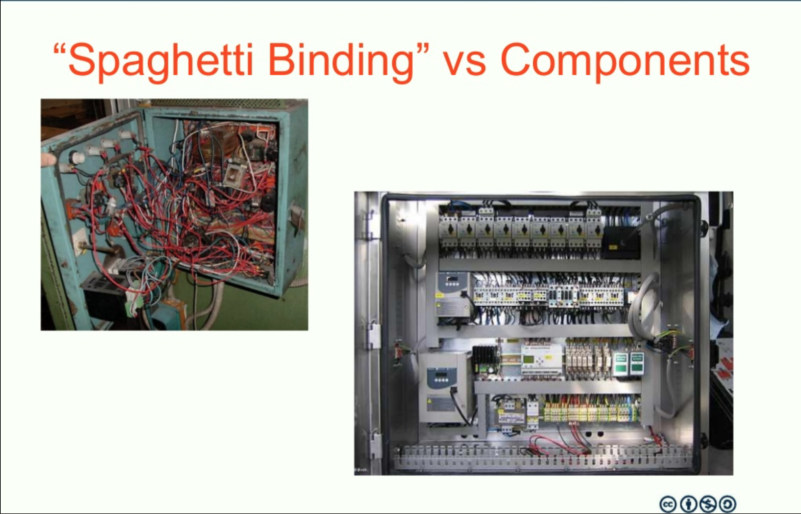

## While you are waiting...

* download the labs from
  * https://github.com/carlobonamico/clean-code-design-principles-in-action

```
git clone https://github.com/carlobonamico/clean-code-design-principles-in-action
```

or plain "Download Zip" from browser


# ABSTRACT
Most developers agree that "Software must be Well-Designed". 

But what is a "Good" Design? 

This workshop presents a core set of Design Principles that will help you make your application easier to implement, change and understand. 

Starting from a focused but realistic specification, we will practice with a Kata where each step introduces a challenge that can be solved by applying different Principles & Patterns.


# TRAINING OBJECTIVES
Through the workshop you will learn to:
* understand the basic dynamics of a complex Software system, and key Design concepts such as Cohesion, Coupling, Abstraction and Impact of Change.
* apply core Design Principles to improve the structure of your applications
* balance the pros & cons of alternative Design choices


# WHO THE WORKSHOP IS DEDICATED TO?
Basically, to all developers! Independently from the language / platform you are developing on, this workshop is for you if:
* you are moving from implementing a detailed specification to designing new features and application
* you are interested in improving your Software Design approach and skills
* you want to develop more robust and maintainable applications with more productivity


# TABLE OF CONTENTS
* What is Software Design? what is a "good" Design?
* Why is it important?
* Key ideas from Event Storming & Domain Driven Design
* Key forces in Software Design

* The Travel Expenses Kata


# TOPICS 
* Single Responsibility Principle for methods
* Single Responsibility Principle for Classes
* Single Responsibility means splitting ...
* How to start?


# TOPICS
* Reviewing your Design
* Collaborating with other classes
* Generalizing the model
* Incremental development and Evolutionary Design
* How to continue by yourself: references for further learning


# PREREQUISITES
* Working knowledge and practical experience in one programming language (you should be able to write/compile/test/debug by yourself a program which reads and parses input and presents output either on the command line or in a simple GUI).
* Good knowledge of Object Oriented concepts (Class, Interface, Method, Variable Scope and Visibility) and ability to "read" them from a sketch/diagram
* Basic knowledge of HTTP


# HARDWARE AND SOFTWARE REQUIREMENTS
* Laptop
* Web Browser (Chrome or Firefox)
* Text Editor (Sublime, Atom, Visual Studio Code,…)
* IDE (Eclipse, NetBeans, Intellij, Visual Studio,.. )
* Pen and Paper


## Key references
* All Labs and links available at
  * https://github.com/carlobonamico/clean-code-design-principles-in-action
  
* Clean Code: the book
  * https://books.google.it/books/about/Clean_Code.html?id=hjEFCAAAQBAJ
  


## What often happens
* huge files
* deep interconnections between features
* cross-cutting mechanisms "spread" everywhere
* fragility and ripple effects
* risk of change increases
* productivity decreases over time

**We need to better design the software**


# What is Software Design? 


# Ideas...
Among all the possible working implementations, 

make a "minimum energy" choice
* that can tolerate some degree of changes ("applied force")
* choosing what to separate and what to keep together

See Carlo Pescio's work
http://www.physicsofsoftware.com/
https://www.youtube.com/watch?v=WPgYju3KnIY


# So
* reducing cost of change
* preventing fragility in the face of changes


# But also 
* reducing cost of development
* making possible to create complex systems
* keeping collaboration effective as team grows

https://martinfowler.com/bliki/DesignStaminaHypothesis.html


# what is a "good" Design?





# Ideas
Good design 
* is visible
* is as simple as possibile

* makes it easy to do the correct things
* makes it difficult to do the wrong things

* helps understanding
* helps reuse

* is sustainable


# TOPICS
* up-front vs continuous design
* Design vs Agile
* Evolutionary vs Emergent Design
* Modeling vs Design


## Maybe if we do Agile, we do not need it? 


# Design is very important even in Agile

## It is just done at different times
* https://martinfowler.com/articles/designDead.html


# Evolutionary Design
* Making things easier to change
* This does not mean that you do not have a vision
* Plan the overall Path
  * but execute a step at a time
  * take decisions __at the last responsible moment__
  * minimize unneeded complexity
  * maximize available information

* Rebecca Parsons' Book
  * https://martinfowler.com/articles/evo-arch-forward.html
  * https://files.thoughtworks.com/pdfs/Books/Building+evolutionary+architecture.pdf


# Emergent Design
* discovery from tests
* discovery from requirements
* making the invisible visibile
* continuous refactoring


# Design is not needed everywhere in the same amount/way
Think of a building
* external structure
* floor height
* wiring / plumbing
* room layout
* furniture layout


# In Software
* interfacing with other system
* splitting the system in modules
* identifying compnents and their interfaces in modules
* implementing low-level details

* repetitive/standard areas vs custom/innovative areas


# So Design needs are very different for 
* UI
* Persistence layer
* Infrastructure 
* Application-specific logic


# Why is it important?
* the two bottlenecks of Software Development: learning and communication
* Managing Complexity


# Learning is the bottleneck
> Software development is a learning process
>
> Working code is a side effect

Alberto Brandolini 

* https://www.youtube.com/watch?v=yQz9ZYU1bfA
* https://www.youtube.com/watch?v=klsksbDJOhI


# Learning to learn
* Kathy Sierra
* https://www.youtube.com/watch?v=FKTxC9pl-WM


# Communication is the bottleneck


# Communication between
* Users / Domain Experts and Developers
* Developers / Team members 
* Future Developers / Maintainers


# Design is a communication tool


# Complexity
Software development tasks are increasingly challenging

We need design to make Complexity tractable
* Essential Complexity
* Accidental Complexity


# Essential Complexity
* inherently present __in the business Domain__

If you oversimplify Essential Complexity, you get 
* higher coupling
* worse defect rate / maintainability 

Can be however reduced through 
  * Abstraction
  * Composition
  * Changing the Context Boundaries


# Accidental Complexity 
* __added__ during the Analysis, Design, Implementation

Can, and must be removed as much as possible

> Simplicity --the art of maximizing the amount 
of work not done-- is essential.

Principles behind the Agile Manifesto


## Improve our code
It takes a Deliberate approach and constant effort

>    To complicate is easy, to simplify is hard
>    To complicate, just add, everyone is able to complicate
>    Few are able to simplify

Bruno Munari


# Complexity vs Design vs understanding
* Encapsulation, Cohesion, Decoupling, Abstraction are important because...
they let us __think__ about a single aspect at a time


# Key ideas from Event Storming & Domain Driven Design


# TOPICS
Key ideas from Event Storming & Domain Driven Design
* Ubiquitous Language
* focus on the Domain
* "Big Picture" vs local consistency (Bounded Contexts)


# Domain Driven Design
Key ideas: 
* focus on the Application Domain
* strong Domain Expert / Developer collaboration
* (Multiple) Consistent Models
  * Bounded Contexts


# Ubiquitous Language
* agree on a single definition / word per concept
  * split concepts whenever it is needed

* always and consistently use it in
  * code
  * documents
  * tests
  * talk


# Why Ubiquitous Language
* reduces ambiguity
* enables Developer - Domain Expert collaboration 
  * or at least review and validation by the Domain Expert


# Model-Driven Design
We think __Model-Centered__ is better

> All models are wrong. Some are useful

* ```Model <--> Code```
* the code should reflect the model as much as possible

* very strong consistency __within a Context__


# Avoid mental mapping
* finite "thinking slots"
* Mental energy is finite
  * attention over time
  * amount of information: 7 +/- 2


# Keep the model consistent and up to date
* continuous refinement
* continuous learning
* progressively more explicit


# Event Storming ideas
* Focus on Domain Events
 * things that happen 

A great way to kickstart the Domain Model discovery
https://www.slideshare.net/ziobrando/50000-orange-stickies-later


# The Travel Expenses Kata


# TOPICS 
The Travel Expenses Kata
* what is a Kata?
* overview of the Kata
* basic requirements


# What is a Kata? 
* Learn by repeating a known track
* but __trying to make it better__ every time

_Deliberate Practice_ means 
  * iterate small skills until >90% perfect
  * focus on improving a specific aspect at a time

https://jamesclear.com/deliberate-practice-theory


# Our Kata
Approach
* focus on the business logic
  * limited UI (only a TXT report)
* see how new requirements impact our design


# General Requirements
Design on paper the macro-structure of an Expense Report Validator Use Case
  * load a single Request from JSON 
  * (in a second phase, also load the Validation Rules)
  * validate one or more conditions (e.g. amount limits)
  * present a TXT or HTML report showing validation results

With the goal of letting the user take a decision and change the status of the request


# Have a look at the inputs...


## Sample Validation Report
```
Employee: Carlo Bonamico
Month: March
Year: 2017

Expenses: 3

Date      Category  Requested Amount  Status  Allowed Amount  
10 March  food                  10.5  NODOC   0            
10 March  food                  35.7  PARTIAL 25
10 March  taxi                  10.2  OK      10.2  
...
March     TOTAL                 66.4          35.2
Warnings
- expenses with no document
Blocking Errors
- overall total > 200 euro
```


# Approach
* Do everything __incrementally__
* start from the basics


# LAB 1- Model storming
* define on paper the main Domain Elements
  * input data (e.g. Request... )
  * output data (e.g. Report.. )
  * processing steps/policies
* define their properties 
* define their relationships
* define main operations

__focus on the application domain__

pay attention to the __Ubiquitous Language__


# DISCUSSION
* which new _"implicit"_ entities appeared in the model? 
* what is the main operation? 
* what are the main steps of this operation? 


# LAB 2 - Identify an implementation roadmap
In 5-10 minutes
* how can we split the design and implementation in 
  * phases
  * sub-tasks


# How to start?
It's difficult!

The general vision is needed, but we must implement it incrementally

> make it smaller!


# Make it smaller: ask yourself questions
* what if instead of X Y Z we only do X?
* A & B -> A then B

* top down vs bottom up

http://agileforall.com/resources/how-to-split-a-user-story/


## Continuous Chain
* Faster small steps beat slower bigger steps
  * concept of __One Piece Flow__ in Lean
* also easier to parallelize

* The smaller the better


# LAB 3 - find the "Minimum Viable Implementation"

* choose a single case to process, from end to the end
  * End-to-end means Request loading to Report output

* keeping the input data
* a simple case
* a __representative__ case


## A chain of Safe steps
> A complex system that works evolves from simpler systems that works

John Gall

https://signalvnoise.com/posts/1414-a-complex-system-that-works-is-invariably

* you need to be able to check that everything works
* review the model frequently
* run frequently 
* test frequently


## Walking Skeleton
* entire application / workflow structure
* made of empty (or logging-only) components
* incrementally filled-in / fleshed out
* also useful for testing

* _in-app mocking_


## How to keep track of what you do and what's missing
* Write it down
* comment it with temporary comments
* code it!
  * write the API you ideally would like to have


# LAB 4 - outline an implementation plan
* Define the main structure
* Split in sub-tastks with post-its
* Discuss the optimal order
* Introduce mock / support steps


## Shared Plan - Phase 1
- Parsing Json -> Minimal (always ok) Validation -> Generate Report
  - generate empty Report
  - generate report with the number of expenses header 
  - generate report with the first expense and allowed amount = amount
- Validate documentation present of the first expenses
  - status in expense line


# Phase 2
- add warnings at the bottom

- Validate amount limit on single expense 
- iterate validations on all expenses
- Compute amount total and allowed amount total (introduce aggregation)

- implement blocking validations ???

- implement monthly overall limit 
- implement monthly limit per Category 


# Advanced Features
- Implement limit per day (Optional)

- implement daily limit per Category  (Optional)


## Incremental commits
* Each commit should start from a stable state and lead to a stable but more complete state


## Link: continuous delivery
http://continuousdelivery.com/


## More Design practice and Katas
* Elefant Carpaccio
  * https://docs.google.com/document/u/1/d/1TCuuu-8Mm14oxsOnlk8DqfZAA1cvtYu9WGv67Yj_sSk/pub


# Key forces in Software Design


# TOPICS 
Key forces in Software Design
* Cohesion
* Coupling
* Impact of Change
* fragile vs robust designs


## Design Principles
Basically, Common Sense applied to Software Design

>Treat your code like your kitchen

C.B., about 2013

easy in the real world...

practice "seeing this way" code and abstract concepts


# Cohesion
Things which 
* are related
* are used togehter
* change for the same reason
* change at the same time
need to stay together (or at least nearby)

Think __forks and knives__

Impacts cost of changing one element


# Coupling
Couple related things, decouple unrelated things
Thinks that 
* are NOT related
* are NOT (necessarily) used togehter
* change for the DIFFERENT reasons
* change at DIFFERENT times
need to stay separate

Think __forks and milk__, or __bread and socks__

Impacts propagation of changes from one element to the others


# Encapsulation 
* Objects have a clear __Outside__ and __Inside__
* helps minimizing the impact of change
* helps reducing coupling


# Idea
Make code easy to __delete__

* https://programmingisterrible.com/post/139222674273/write-code-that-is-easy-to-delete-not-easy-to

* https://18f.gsa.gov/2016/06/24/5-lessons-in-object-oriented-design-from-sandi-metz/


# A "bad" example
How does our code become unmanageable? A practical example
- fast-forward demo through the life of an (apparently) trivial function


## Parsing Expenses from CSV
```csv
10/01/2015, 10.50
11/01/2015, 8.50
12/01/2015, 5.50
15/01/2015, 8.50
```


## The results
120 Lines, and already unmaintainable

[labs/clean-code-expenses-ugly](labs/clean-code-expenses-ugly)


## the effects: 
* simple changes impact most of the codebase
* code-writing time -> decreases
* application-ready time -> never done
* time needed for bug fixes and new features -> increases


## Why? 
* reading code vs writing code
* understanding effort
* fragility due to interdependence

* Symptoms of Rotten Design
  * http://www.objectmentor.com/resources/articles/Principles_and_Patterns.pdf


## What can we do about that? 
Clean Code, Design Principles and Lean to the rescue
- improving our code
- improving our design
- iterate 
- practice, practice, practice and continuous / daily improvement (Kaizen)


# LAB 5 - Implement the first steps 
paying attention to Cohesion and Coupling

- Parsing Json -> Minimal (always ok) Validation -> Generate Report
  - generate empty Report
  - generate report with the number of expenses header 
  - generate report with the first expense and allowed amount = amount


# Synchronization point
You should have at least classes for these concepts: 
* loading and parsing the Request
* validator process
* validation result
* generating output txt from validation result


# Works != Done
If you identified initially 1-2 classes, take some time to split them

And name them well


## Do you know this man? 
Google "Ignaz Semmelweis"


## It is _not_ brain surgery 
* Ignaz Semmelweis
  * http://www.npr.org/sections/health-shots/2015/01/12/375663920/the-doctor-who-championed-hand-washing-and-saved-women-s-lives
  * http://semmelweis.org/about/dr-semmelweis-biography/

* He championed washing hands before childbirth and surgery


## Clean Code and Basic Design Principles
* cannot solve all development problems...

* But can make them way more tractable!


especially if applied consistently.

> Never underestimate the impact of doing something all the time 

The power of compounding many small changes _in the same direction_


## The Boy Scout Rule
>Leave the campsite a little better than you found it

>Every time you touch some code, leave it a little better


# Single Responsibility Principle for methods


# TOPICS
Single Responsibility Principle for methods
* separing inputs from outputs
* Primitives vs orchestrators
* if you have to do 3 things, make 4 functions
* Steps vs Flow


## Single Responsibility
>Each function should do 1 thing

Or even better, have a single responsibility
* and reason to change

As with all Design Principles, this is more of a __compass direction__ than an absolute rule


## how to find responsibilities? 
Ask yourself questions...

* What? 
* Who?
* When?
* Why?
* Where?

And put the answer in different sub-functions


## 3 things, 4 functions
If your function needs to perform a non-trivial task: 
* import data, transform it and store it in the DB

Instead of 
```js
  readData(){
    file.open();
    while(..)
      {
        line = readLine();
        obj = trasformLine(line);
        saveInDB(obj); 
      }
  }
```
what's better?


## 3 things, 4 functions 
```
  importData(){
    data = readData();
    obj = transformData (data); 
    saveInDB(obj);
   }  
```

* a function for each step
* a function to call the steps


# LAB 6 - review your methods
* Particularly the validate() and generate() functions
* Split the methods in elementary responsibilities


# Synchronization point
At this point you should have at least separate methods for 
- validating a single expense
- generating the header
- generating the validated expenses table
  - generating a single line of the output
- generating the footer


## Primitives, Orchestrators, level of abstraction
* Primitives: small, focused, typically use-case independent
* Orchestrators: implement use-cases by combining primitives

* rinse and repeat over multiple levels of abstraction

* benefits:
  * more reusable
  * easier to test
  * easier to understand


# Steps vs Flow
* Another example: have methods for each step of an algorithm
* another method to decide the flow among them


## Lab 7 - add more validations
- Validate documentation present of the first expenses
  - status in expense line
- add warnings at the bottom (Optional)


# Single Responsibility Principle for Classes


# TOPICS 
Single Responsibility Principle for Classes
What is a Responsibility
* reason to change
* what if ...
* looks similar vs changes for the same reason


## Single Responsibility Principle
Have you ever seen your grandmother put dirty clothes in the fridge?

Or biscuits in the vegetable box?

So, why to we do this all the time in our code? 


## Single Responsibility Principle
Responsibility == __reason to change__


## SRP - Again
A class should do one thing
* and have a single reason to change 

Consequences:
* classes should be small
* classes should be focused
* classes need to collaborate to perform complex tasks


# LAB 8 - color the responsibilities
* Take the biggest class written up to now or any other code example
* Paste it in word / Google Docs
* Outline in different colors the various responsibilities


# LAB 9 - Validate all individual amounts
- Validate amount limit on single expense 
- iterate validations on all expenses

Question: where do we take the limit from? 


# Reviewing your code 
Look at parts of the code and ask yourself what if that changes?


# Synchronization point
At this point you should have separate classes for 
* validating the amount of a single expense
* validating the documentation presence
* iterating on all expenses


# looks similar vs changes for the same reason
https://web.archive.org/web/20090411030053/http://threeriversinstitute.org/blog?p=104

Sandy Metz
https://www.sandimetz.com/blog/2016/1/20/the-wrong-abstraction


# Single Responsibility means splitting ...


# TOPICS Single Responsibility means splitting ...
* UI from logic
* Logic from persistence
* I/O from logic
* Sync from Async
* Intent from implementation


# Layered Architecture
* each layer depends only on lower layers
* ideally, with the domain layer at the bottom 
  * _Hexagonal Architecture_


# TOPICS 
Reviewing your Design
* naming
* model out loud
* validate with examples
* what if this changes?
* the Open / Closed Principle


# Continuously refined Model
* Knowledge crunching
* maintaining Model consistency
* continuous learning
* breaktroughs
* making implicit explicit


## reading code vs writing code
>What is written without effort is in general read without pleasure.
>
>Samuel Johnson

Most code is written once, but read
* every time you need to fix a bug
* to add new features
* by other developers
  * including your future self 


## What is a good name


 * nonsense / honest / honest & complete / does the right thing / intent
 * domain abstraction

http://llewellynfalco.blogspot.it/p/infographics.html


# LAB 10 - review your design
* check naming
* check if you can make implicit concepts visible


# TOPICS 
Collaborating with other classes
* Prefer Composition to Inheritance
* Dependency Injection


## Collaborating classes
* We need a way of making collaboration easier

* With Dependency Injection
  * separate creation of classes from linking instances
  * create A
  * create B
  * something else passes or __injects__ B into A


# Dependency Injection
Goal: using capabilities from another object should be almost as easy as calling a method in your object
* You do not (necessarily) need a framework for that...


# LAB: separate class initialization and wiring


## Inheritance - with caution
* Inheritance is the strongest link between classes
* useful with caution


## Prefer composition
* combine parts 
* a derived class becomes the composition of a base behaviour + additional custom behaviour

Achieve complex structures, behaviours, interactions  by __composing__ and __coordinating__ simple elements


# LAB: Monthly Expense limits 
Compute amount total and allowed amount total (introduce aggregation)
- implement monthly overall limit 
- delegating aggregation to dedicated class

Validate aggregate properties = Aggregate + Validate result 

* Define the main structure
* Split in incremental sub-tastks 
* Discuss the optimal order


## Interfaces and Contracts
* explicit vs implicit
* Decoupling changes and detecting regressions
* separate 
  * clean parts from dirty code
  * Intent from Implementation


# Types of interaction
* what is effective in the small 
  * e.g. everyone talking at the same time in a room to solve a problem
  * interaction within local variables

chaos if same approach applied in the large
* anyone talking to anyone
* global interactions


# LAB: Generalizing the validation process
* Introduce the Validator interface
  * inputs
  * outputs
* Define a list of individual validators
* separate the validators from their application to the expenses


## OCP 
>Open for extension, Closed for Modification


# LAB: Validating Monthly constraints per category
- implement limit per category
- Implement limit per day (Optional)


## Lab: impact analysis 
* Revise the expenses lab in the light of these concepts
* Consider the impact of the following additional requirements
  * allow the operator to manually modify the allowed reimbursement 
  * enable the ``Approve`` button only if there are no blocking errors


# LAB: Validating Expense limits per day
- implement daily limit per Category  (Optional)


# What we have learned 
Generalizing the model
* making the implicit explicit
* Levels of abstraction vs Levels of implementation
* breakthroughs
* Emergent Design


# LAB: Making Validation Rules configurable
Introduce the concept of Validation Rule
* implement it 
* istantiate it in code


# LAB
* load validation rules from file


## How to do everything incrementally
* You can do _everything_ incrementally
  * decouple release from deployment
  * branch by abstraction
  * do both
  * expand-contract


# Decouple release from deployment


# Expand-Contract
Refactor from A to B
* First do A
* then do A + part of B
* then do B
* then remove A  


# CONCLUSION


## Testable code and Good Design aligment
Things that make code testable
* clear interfaces
* small classes / functions
* decoupled
* composition

Things that make code well-designed, easy to evolve
* clear interfaces
* small classes / functions
* decoupled
* composition


## The principles
So what did we just do? Understand the principles
- the relationship between quality and productivity
- the need for a continuous chain of small, safe steps of design &
implementation


## Quality vs Productivity 
Traditionally, Quality is seen as an alternative to raw development Speed
* this is partly true only in the short term

Four quadrants: 
* high quality, high productivity -> tends to further improve
* high quality, low productivity -> tends not to improve, and go to
* low quality, low productivity -> tends to get worse 
* low quality, high productivity -> tends to go to the previous one

* Productivity curves at different quality ratio


# How to continue by yourself: references for further learning
* improving our design
* practice, practice, practice and continuous / daily improvement (Kaizen)
* Principles of Package Design
* More on TDD: Test-friendly vs Well-designed


## Improve our code
It takes a Deliberate approach and constant effort

>    If I don't practice for a day, I notice

>    If I don't practice for two days, my orchestra notices

>    If I don't practice for three days, the public notice

Claudio Abbado

- practice, practice, practice and continuous / daily improvement (Kaizen)


# Principles of Package Design
The same concepts can be applied at the package level
* Java package / .Net namespace
* Java JAR / .Net assembly
* https://en.wikipedia.org/wiki/Package_principles


See Robert C. Martin
* https://vimeo.com/68236438


## More practice and Katas
* http://matteo.vaccari.name/blog/tdd-resources
* https://github.com/xpmatteo/simple-design-in-action/tree/master/stage-01-hello-world/script
* http://codekata.com/
* https://www.industriallogic.com/blog/modern-agile/


## Learning to learn
* Kathy Sierra
* https://www.youtube.com/watch?v=FKTxC9pl-WM


# Event Storming
http://www.slideshare.net/ziobrando/event-storming-recipes
https://www.youtube.com/watch?v=veTVAN0oEkQ 
http://www.slideshare.net/ziobrando/idea-stickies-green-bar-wroclaw-edition


# Team Improvement 
About how to improve teamworking and raise technical proficiency and autonomy

The phoenix Project
http://itrevolution.com/books/phoenix-project-devops-book/

Drive (sulla motivazione)
https://books.google.it/books?id=E0H_DIkg0I4C

http://www.davidmarquet.com/


